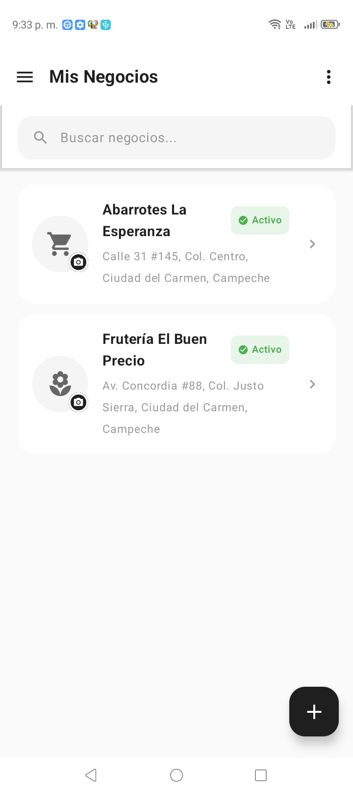
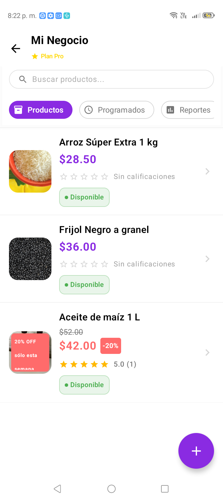
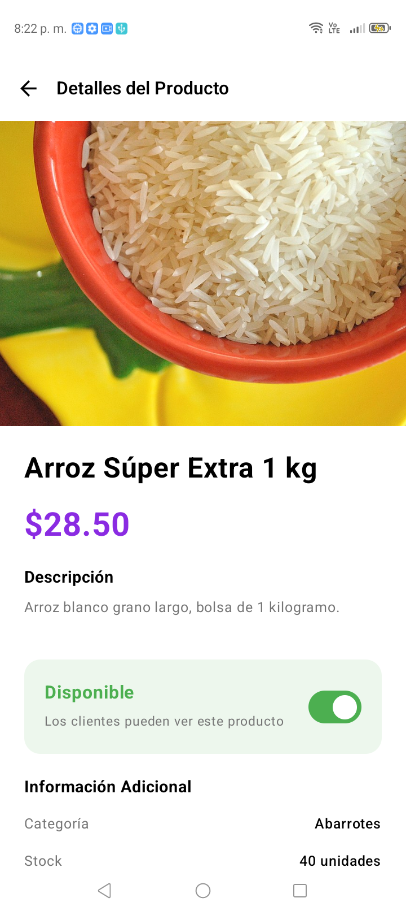

# EcoMap

Dos aplicaciones **Android nativas** en Kotlin y Jetpack Compose que conectan al comercio local de **Ciudad del Carmen, Campeche** con sus clientes: los negocios publican precios y ofertas, y los vecinos los encuentran en un mapa.

| | |
|---|---|
| **EcoMap Socio** | Lado comercio: alta de negocios, inventario, ofertas, ofertas programadas, estadísticas y reportes |
| **EcoMap Usuario** | Lado cliente: mapa, búsqueda, favoritos, canasta con análisis de precios, reportes e historial |

Las dos comparten un mismo backend en Supabase (PostgreSQL).

<p align="center">
  
  
  
</p>

---

## Stack

| Área | Tecnología |
|---|---|
| Lenguaje | Kotlin 2.0.21 |
| UI | Jetpack Compose · BOM 2024.09.00 · Material 3 (sin XML de pantallas) |
| Arquitectura | MVVM en capas: `data` / `domain` / `presentation` |
| Inyección | Hilt 2.54 + KSP |
| Navegación | Navigation Compose 2.8.5 |
| Backend | Supabase — PostgreSQL, Auth, Storage, Realtime, Edge Functions |
| Mapas | osmdroid 6.1.20 sobre OpenStreetMap |
| Geocodificación | Nominatim vía Retrofit 2.11 |
| Red | Ktor + OkHttp |
| Imágenes | Coil 2.7 |
| Gráficas | Vico 1.14 |
| Segundo plano | WorkManager 2.9.1 |
| Pruebas | Compose UI Test (instrumentadas) |

`minSdk 24` · `targetSdk 36` (Socio) / `35` (Usuario)

## Estructura

```
socio/      EcoMap Socio    — app Android
usuario/    EcoMap Usuario  — app Android
db/         Esquema de PostgreSQL, parches de seguridad y Edge Functions
docs/       Documentación técnica
```

## Backend

Sin servidor propio: las apps hablan directo con PostgREST, y la seguridad la sostienen las políticas de Row Level Security y funciones `SECURITY DEFINER`.

**14 tablas** — `users`, `businesses`, `products`, `offers`, `scheduled_offers`, `notifications`, `product_ratings`, `product_complaints`, `product_reports`, `user_preferences`, `basket`, `favorites`, `user_history`, más la vista `product_rating_stats`.

**Realtime** en `users`, `businesses`, `products`, `notifications`, `offers` y `scheduled_offers`, para que un cambio de estado o una oferta nueva aparezcan sin recargar.

**Storage**: 5 buckets. El de documentos de verificación (INE, comprobante de domicilio) usa **enlaces firmados con caducidad**, no URLs públicas.

## Detalles técnicos que vale la pena mirar

**Productos de negocio y productos comunitarios en una sola tabla.** Un producto tiene `business_id` (lo publica un comercio) **o** `user_id` (lo publica un vecino sin local), nunca ambos; lo garantiza un `CHECK`. Los comunitarios pasan por moderación y expiran a las 8 horas mediante un trigger; los de negocio no, porque el vendedor ya pasó verificación de documentos.

**Horarios partidos.** `operating_hours` guarda un JSON con turnos por día, así un negocio puede abrir de 6:30 a 14:00 y de 16:00 a 20:00.

**Ofertas programadas** (función PRO): se publican solas cuando llega su fecha, vía la función `publish_scheduled_products()`.

**Una cuenta por rol.** Cada app rechaza al usuario de la otra según `user_type`, para que un comercio no entre por la app de clientes ni al revés.

## Seguridad

Este proyecto pasó por una **auditoría de seguridad completa**, documentada en **[docs/AUDITORIA_SEGURIDAD.md](docs/AUDITORIA_SEGURIDAD.md)**.

El hallazgo más grave: la app descargaba la fila del usuario y comparaba el **código de verificación en el dispositivo**. Como la anon key viaja dentro del APK, cualquiera podía leer el código de recuperación de otra cuenta con **una sola petición HTTP** y apoderarse de ella.

Se corrigió moviendo la validación a un RPC `SECURITY DEFINER` (el código ya nunca sale de la base), cerrando el RLS de `users` a la propia fila y revocando el acceso de `anon`. La corrección está **verificada contra el servidor**: el ataque ahora responde `permission denied`.

En total, **9 hallazgos**, 8 corregidos. Los parches SQL están en `db/`.

## Pruebas

Prueba instrumentada de UI que recorre el flujo principal — Dashboard → scroll → abrir negocio → abrir producto — validando los textos reales en pantalla:

```bash
cd socio && ./gradlew :app:connectedDebugAndroidTest
```

```
com.ecomap.socio.DashboardToProductDetailTest
tests=1  failures=0  errors=0  skipped=0  time=12.559s
```

Usa un helper `awaitText()` con `waitUntil` en lugar de `waitForIdle()`: la app tiene animaciones de carga que nunca dejan la composición en reposo y colgarían la prueba. Es una prueba end-to-end, contra el backend real.

## Cómo compilarlo

1. **`local.properties`** en `socio/` y en `usuario/` (hay plantilla en `local.properties.example`):

   ```properties
   sdk.dir=RUTA_A_TU_ANDROID_SDK
   supabase.url=https://TU-PROYECTO.supabase.co
   supabase.key=TU_ANON_KEY
   ```

2. **Base de datos** — en el SQL Editor de Supabase, en este orden:

   ```
   db/init_demo_db.sql              esquema completo + datos de ejemplo
   db/security_patch_01_auth.sql    autenticación blindada
   db/security_patch_02_datos.sql   RLS del resto de las tablas
   ```

3. **Storage** — crear los buckets `avatars`, `product-images`, `complaint-images`, `rating-images` y `verification-documents`.

4. **Auth** — desactivar *Confirm email*: las apps manejan su propio código de verificación.

5. **Compilar** (requiere JDK 17+ y Android SDK 35/36):

   ```bash
   cd socio && ./gradlew :app:assembleDebug
   ```

## Estado

Funcional y probado en dispositivo físico (ZTE 7060, Android 13). Pendiente: configuración de firma para release y publicación en tienda.

---

Desarrollado por **Victor Hernández** · Ciudad del Carmen, Campeche
